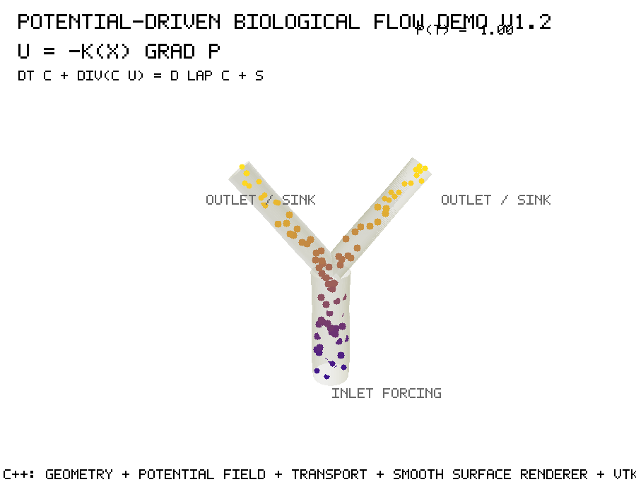

# Potential-driven biological flow in a synthetic 3D conduit

A compact C++17 demonstration of **geometry- and potential-driven transport** in a synthetic three-dimensional biological conduit-like domain.

This repository explores a simple but general idea: in living systems, transport is rarely explained by geometry alone. Biological flow, redistribution, signaling, uptake, and morphogenetic dynamics often emerge from the interaction between spatial structure, gradients, boundary forcing, local conductance, and time-dependent state variables.

The demo is intentionally minimal. It is not a physiological simulator, a CFD solver, or a validated model of any specific organism or organ. Instead, it is a reproducible scientific-computing exercise showing how a mechanistic idea can be translated into code: define a domain, define a driving potential, simulate transport, and visualize the resulting dynamics.

---

## Scientific motivation

Mechanistic modeling becomes scientifically useful when the mechanisms are visible.

A model should not be treated as a closed package whose inputs and outputs are analyzed after calibration. Its scientific value depends on whether its assumptions, state variables, rates, boundary conditions, spatial structure, and outputs can be inspected, modified, and interpreted.

This small demo follows that philosophy. A synthetic 3D conduit-like structure is generated computationally. A scalar pressure/potential field defines a driving force. A transported marker evolves through the domain. The resulting dynamics are rendered as a rotating 3D animation.

The purpose is not to solve a complete biological problem, but to make explicit the computational logic linking:

- geometry;
- potential gradients;
- transport direction;
- diffusion or dispersion;
- boundary forcing;
- time evolution;
- scientific visualization.

This structure is relevant to several classes of living systems. Depending on the geometry and boundary conditions, the same abstract workflow can be adapted to pressure-driven biological flow, uptake-driven transport, polarized growth, local redistribution, or morphogenesis-like dynamics.

---

## Conceptual background

Previous work on the Runoff Potential Index developed the idea that a 3D spatial structure can be transformed into interpretable dynamic information by combining local curvature, gradient magnitude, and divergence-like reasoning.

In that context, terrain morphology was not treated as static geometry only. Instead, geometry was used to infer redistribution potential across 3D surfaces. This repository translates the same broader modeling attitude into a different computational setting: a synthetic biological conduit where geometry and potential gradients jointly organize transport.

The connection is conceptual rather than application-specific.

- In the Runoff Potential Index, a surface morphology informs water redistribution potential.
- In this demo, a conduit-like morphology and a pressure/potential field inform transport dynamics.
- In both cases, the key idea is to move from static structure toward interpretable process.

This makes the repository a small bridge between geometry-derived dynamic indices, mechanistic biological modeling, and scientific visualization.

Related work:

- Scientific Reports article: https://www.nature.com/articles/s41598-025-34699-5
- Runoff Potential Index MATLAB toolbox: https://fr.mathworks.com/matlabcentral/fileexchange/181258-the-runoff-potential-index-upland-lowland-differentiation

---

## Mathematical model

The demo represents potential-driven transport in a synthetic 3D biological conduit-like domain.

A scalar potential field \(P(\mathbf{x})\) defines a driving force. The induced flow direction is approximated as:

\[
\mathbf{u}(\mathbf{x}) = -K(\mathbf{x}) \nabla P(\mathbf{x})
\]

where:

- \(P(\mathbf{x})\) is a pressure/potential-like field;
- \(K(\mathbf{x})\) represents an effective conductance or permeability;
- \(\mathbf{u}(\mathbf{x})\) is the induced transport direction.

A transported marker \(c(\mathbf{x},t)\) evolves according to a simplified advection-diffusion equation:

\[
\frac{\partial c}{\partial t} + \nabla \cdot (c\mathbf{u}) = D\nabla^2 c + S
\]

where:

- \(c(\mathbf{x},t)\) is a concentration-like transported marker;
- \(D\) is an effective diffusion or dispersion coefficient;
- \(S\) represents inlet forcing, source terms, or localized supply.

The implementation is deliberately compact. It is designed to demonstrate the modeling workflow, not to provide a validated physiological prediction.

---

## Biological transferability

The same computational structure can be reinterpreted across different living systems by changing geometry, forcing, and parameterization.

| Modeling component | Generic role | Possible biological interpretation |
|---|---|---|
| 3D conduit geometry | Spatial constraint | Vessel, duct, root-associated channel, polar growth domain, synthetic tissue-like conduit |
| Potential field \(P\) | Driving force | Pressure, suction, water potential, chemical potential, mechanical gradient |
| Conductance \(K\) | Local transport capacity | Permeability, resistance, tissue conductance, hydraulic capacity |
| Transported marker \(c\) | Dynamic state variable | Tracer, solute, signal, transported material, concentration-like quantity |
| Source/sink \(S\) | Boundary forcing | Inlet forcing, uptake, local demand, growth-associated sink |

For a cardiac context, the potential field can be read as a simplified pressure-like driver.  
For root or plant-associated systems, it can be interpreted as suction, water potential, or uptake-driven transport.  
For polarized growth or morphogenesis-inspired systems, it can represent a localized potential or directional field guiding material redistribution.

These are not claims of direct biological realism. They indicate how the same numerical architecture can be extended toward different mechanistic modeling problems.

---

## Computational geometry and visualization

The demo also includes a lightweight computational-graphics component.

The simulation is performed on a synthetic 3D domain. During the run, the C++ code generates rotating frames that visualize:

- the conduit-like spatial domain;
- the dynamic transported marker;
- the propagation of concentration-like material through time;
- the effect of potential-driven transport.

The animation is not produced from a pre-rendered external model. It is generated from the simulated fields. This makes the visualization part of the reproducible computational workflow.

The workflow is:

```text
C++ geometry generation
→ potential field definition
→ transport simulation
→ frame rendering
→ GIF assembly
```

Python is used only to assemble the generated image frames into a GIF.

---

## What this demo shows

This repository demonstrates:

- C++17 implementation of a compact numerical simulation;
- CMake-based compilation;
- synthetic 3D geometry generation;
- potential-driven transport logic;
- dynamic marker propagation;
- lightweight frame rendering;
- VTK-compatible scientific output;
- GIF generation for visualization;
- reproducible organization of a scientific-computing project.

---

## What this demo does not claim

This is not:

- a validated hemodynamic model;
- a complete CFD solver;
- a finite-element implementation;
- a physiological simulator;
- a plant-root, pollen-tube, or cardiac-specific model;
- a replacement for specialized numerical simulation frameworks.

It is a focused demonstration of how mechanistic modeling concepts can be expressed in code.

---

## Repository structure

```text
.
├── CMakeLists.txt
├── README.md
├── src/
│   └── main.cpp
├── scripts/
│   └── make_gif.py
├── docs/
│   └── demo_preview_v1_2.gif
└── output/
    ├── frames/
    └── vtk/
```

The `output/` directory is generated at runtime and is not tracked by Git.

---

## Build

```bash
mkdir -p build
cd build
cmake ..
cmake --build .
```

---

## Run

From the `build/` directory:

```bash
./potential_flow_demo ../output
```

This generates simulation frames and VTK-compatible outputs.

Expected outputs include:

```text
output/frames/frame_0000.ppm
output/frames/frame_0001.ppm
...
output/vtk/
```

---

## Generate the GIF

From the repository root:

```bash
python3 scripts/make_gif.py output/frames docs/demo_preview_v1_2.gif
```

Alternatively, using ImageMagick:

```bash
magick -delay 4 -loop 0 output/frames/frame_*.ppm docs/demo_preview_v1_2.gif
```

---

## Reference build environment

The reference run was generated on macOS using:

```text
Compiler: AppleClang 14.0.3
CMake: 4.3.2
Language standard: C++17
```

The simulation core and frame generation are implemented in C++. Python is used only for final GIF assembly.

---

## Demonstration

The animation below shows the resulting potential-driven transport dynamics in the synthetic 3D conduit-like domain.



---

## Status

This repository is currently maintained as an initial stable demonstration release.

The current version provides a complete and reproducible workflow for:

- synthetic 3D conduit generation;
- potential-driven transport simulation;
- C++ frame rendering;
- VTK-compatible output;
- GIF-based visualization for quick inspection.

Future extensions may include alternative geometries, additional boundary conditions, and more advanced numerical formulations.

---

## Author

Edgar S. Correa
